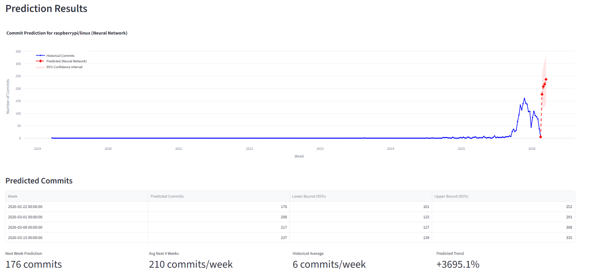

# GitHub Activity Predictor

Forecast GitHub repository activity (commits, stars, issues, PRs) using time-series and neural network models.



## Features

- **Three Forecasting Models**: Prophet, FARIMA, and Neural Network (MLP)
- **Automatic Model Selection**: Cross-validation and hyperparameter tuning
- **Data Pipeline**: Ingestion, validation, weekly aggregation
- **MLflow Tracking**: Experiment logging and model registry
- **REST API**: FastAPI server with authentication
- **Dashboard**: Interactive Streamlit interface
- **Docker Support**: Containerized deployment  

## Quick Start

**Using Docker (Recommended)**

```bash
docker compose up --build -d
```

Access the services:
- **Dashboard**: http://localhost:8501
- **MLflow**: http://localhost:5000
- **API**: http://localhost:8000

**Local Development**

```bash
pip install -e .
mlflow ui --port 5000 &
streamlit run src/dashboard.py
```

## Models

| Model | Description |
|-------|-------------|
| **Prophet** | Facebook's decomposition model for seasonality |
| **FARIMA** | Fractional differencing for long-range dependencies |
| **Neural Network** | MLP using PRs-commits correlation |

## API Usage

```bash
# Predict repository activity
curl -X POST http://localhost:8000/predict \
  -H "X-API-Key: demo-api-key-12345" \
  -H "Content-Type: application/json" \
  -d '{
    "repository": "tensorflow__tensorflow",
    "target_column": "commits",
    "model_type": "prophet",
    "horizon": 8
  }'
```

## Forecasting Method

Recursive multi-step forecasting simulates real deployment:

1. Train on historical data
2. Predict next step
3. Append prediction to history
4. Repeat for full horizon

This reflects real conditions where future data is unavailable.

## Data Format

Each repository directory should contain:
- `commits.csv` - Commit timestamps
- `issues.csv` - Issue creation dates
- `pull_requests.csv` - PR creation dates
- `stargazers.csv` - Star timestamps

Output: Weekly aggregated metrics (`commits`, `new_stars`, `issues_opened`, `prs_opened`)

## License

MIT
