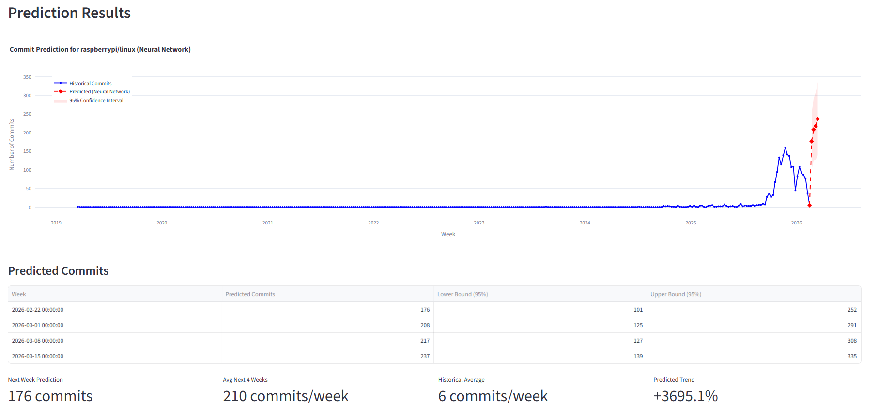

# Repo Pulse

Forecast monthly commit activity for any public GitHub repository, using a LoRA fine-tuned [Chronos](https://github.com/amazon-science/chronos-forecasting) transformer.



**Live demo:** https://huggingface.co/spaces/NaifSaleem/repo-pulse

## What

Paste a GitHub repo URL, pick a horizon (1–12 months), get a forecast of monthly commit counts. The app runs three forecasters side by side:

1. **Ours** — Chronos-T5-small fine-tuned with LoRA on ~120 public GitHub repos
2. **Chronos zero-shot** — same base model, no fine-tuning
3. **Naive seasonal** — repeats the last 12 months

The whole point: prove the fine-tuning adds value, and prove it transparently.

## Results

Backtest on 30 validation repos (never seen during training). Results are regenerated by `python training/evaluate.py` after each release of the LoRA adapter and committed to `training/results.md`.

| Horizon | Ours (FT) | Chronos ZS | Naive |
|---------|-----------|------------|-------|
| 1 month | _see `training/results.md`_ | | |
| 3 months | | | |
| 6 months | | | |
| 12 months | | | |

Metric: SMAPE (lower is better). Reproduce in 5 min with `bash scripts/reproduce.sh`.

## Architecture

```
training/build_dataset.py   →   HF Datasets: NaifSaleem/github-monthly-commits
training/train.py           →   HF Hub: NaifSaleem/chronos-github-commits (LoRA adapter)
app.py (HF Spaces)          →   fetch URL → aggregate monthly → 3 forecasts → chart
```

## Reproduce

```bash
pip install -e ".[dev,training]"

# 1. Build dataset (requires GITHUB_TOKEN)
python training/build_dataset.py --split train
python training/build_dataset.py --split validation

# 2. Fine-tune (requires GPU; ~1-2h on Colab T4)
python training/train.py

# 3. Evaluate
python training/evaluate.py

# 4. Run the app locally
python app.py
```

Or, to only reproduce the results table from published artifacts:

```bash
bash scripts/reproduce.sh
```

## Limitations

- **Young repos (<24 months of history):** forecast displayed but flagged in the UI as low-confidence.
- **Domain shift:** training set is biased toward popular OSS projects. Small private-style repos may forecast less accurately.
- **Univariate only:** the model predicts commits without conditioning on stars/issues/PRs. A multivariate extension is on the next-steps list.
- **Latency:** large repos (200k+ commits) take 30–60 s to fetch on first request. Cached for 24 h thereafter.

## License

MIT
